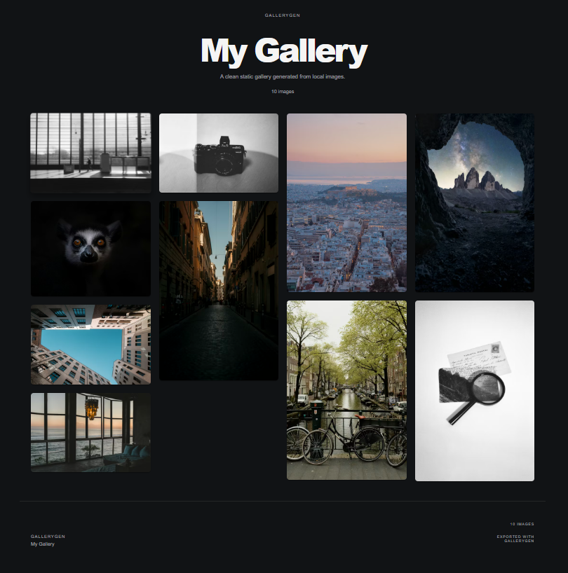

# GalleryGen

> Turn local screenshots, product visuals, and photography into a polished static showcase page — offline, in minutes.
>
> 把本地截图、产品视觉或摄影作品，在几分钟内整理成一页精致的静态展示站 —— 离线完成。

**Use it in 3 steps:** upload → pick a template → export a static showcase.

**使用只要 3 步：** 上传 → 选模板 → 导出静态展示页。



---

## Try It Online / 在线体验

> **[→ Open the live builder](https://gallerygen.netlify.app/)** — no install, no account, no backend. Drop images and start building right now.
>
> **[→ 打开在线 Builder](https://gallerygen.netlify.app/)** — 无需安装、无需注册、没有后端。拖入图片就能开始。

<sub>Want to see finished output first? Browse live template examples: <a href="https://gregarious-narwhal-e05197.netlify.app/">Template A — Editorial / Archive</a> · <a href="https://elaborate-starlight-03236e.netlify.app/">Template B — Showcase / Product</a></sub>

<sub>想先看成品？浏览在线模板示例：<a href="https://gregarious-narwhal-e05197.netlify.app/">Template A — Editorial / Archive</a> · <a href="https://elaborate-starlight-03236e.netlify.app/">Template B — Showcase / Product</a></sub>

<sub>Developers: scroll down to **Local Development** if you prefer to run GalleryGen locally. / 开发者：如需本地运行，请滚动到下方的 **Local Development** 章节。</sub>

---

## Why GalleryGen

GalleryGen fixes three things developers and designers hit over and over.

- **Heavy READMEs.** A GitHub README gets unreadable once ten screenshots are inlined. GalleryGen keeps one preview image in the README and links out to a full interactive showcase page.
- **Privacy.** Everything runs locally in your browser. No upload queue, no cloud, no account, and no image ever leaves your machine unless you choose to publish it.
- **Professional mockups.** Raw screenshots look flat. GalleryGen wraps them in desktop or mobile device frames, arranges them with real layout rhythm, and exports a page that looks like a product site.

## 为什么使用 GalleryGen

GalleryGen 针对开发者和设计师反复遇到的三个问题而生。

- **臃肿的 README。** 一旦截图超过十张，GitHub README 就会变得拖沓。GalleryGen 让你只在 README 保留一张预览图，其余跳转到完整的交互展示页。
- **隐私。** 全流程在浏览器本地完成。没有上传队列、没有云端、没有账号，图片不会离开你的设备，除非你主动发布。
- **专业感的产品图。** 纯截图看起来很扁平。GalleryGen 会把截图放进桌面或手机外壳，按真实排版节奏布局，导出的页面更像一个产品站。

---

## Core Workflow / 核心工作流

Three steps. No configuration. Everything is local.

三步完成，无需配置，全程本地。

1. **Drop** — drag local images or screenshots into the builder. / 把本地图片或截图拖进 Builder。
2. **Showcase** — pick a template, edit title and description, preview live. / 选择模板，编辑标题和描述，实时预览。
3. **Export** — download a ZIP with static HTML, CSS, and images, ready to publish. / 下载含静态 HTML、CSS 和图片的 ZIP，即可发布。

---

## Template Roles / 模板角色

GalleryGen ships with two intentionally distinct templates. They are not cosmetic variants — they target different presentation jobs.

GalleryGen 自带两套方向明确的模板，不是皮肤差异，而是面向不同的展示任务。

### Template A — Editorial / Archive

Best for art, photography, curated image collections, and portfolio-style galleries. Quiet editorial rhythm, generous spacing, and image-first presentation.

适合艺术作品、摄影、精选视觉集合和作品集风格的展示页。安静的编辑感节奏、大量留白、图片优先的视觉表达。

[View cover](public/readme/template-a-cover.png) · [Live example](https://gregarious-narwhal-e05197.netlify.app/)

### Template B — Showcase / Product

Best for SaaS screenshots, open-source project demos, UI mockups, and design boards. A strong lead visual, a structured supporting grid, and desktop / mobile device frames.

适合 SaaS 截图、开源项目演示、UI 样机和设计看板。更强的主视觉、结构化的辅助网格，以及桌面 / 手机设备外壳。

[View cover](public/readme/template-b-cover.png) · [Live example](https://elaborate-starlight-03236e.netlify.app/)

---

## After You Export / 导出之后怎么做

Once you click **Export ZIP**, here is the full path from local file to a shareable public URL.

点击 **Export ZIP** 之后，从本地文件到可分享公开链接的完整流程如下。

### 1. Unzip & preview locally / 解压并本地预览

Extract `your-gallery.zip` into any folder. You can open `index.html` directly in a browser to check the final look before publishing.

把 `your-gallery.zip` 解压到任意文件夹。发布之前可以直接用浏览器打开 `index.html` 检查最终效果。

### 2. Get a public link with Netlify Drop / 用 Netlify Drop 获取公开链接

The fastest path. Open [Netlify Drop](https://app.netlify.com/drop), drag the **extracted folder** (not the ZIP) onto the page, and you will immediately get a `*.netlify.app` URL. Sign in to keep and update the same link over time.

最快的一条路径。打开 [Netlify Drop](https://app.netlify.com/drop)，把**解压后的文件夹**（不是 ZIP）拖到页面上，立刻就能拿到一个 `*.netlify.app` 公开链接。登录后可以长期保留并更新这个链接。

### 3. (Optional) Host on GitHub Pages for long-term projects / （可选）用 GitHub Pages 做长期托管

Prefer to keep the showcase alongside your project? Create a new repository (or a `gh-pages` branch on an existing one), upload the exported files, and enable Pages in repository settings. Good for open-source project pages and project docs.

希望展示页长期挂在 GitHub 项目旁边？新建一个仓库（或在已有仓库创建 `gh-pages` 分支），上传导出的文件，在仓库 Settings 里启用 Pages。适合开源项目主页和项目文档。

### 4. Paste the README snippet back / 把 README 片段贴回去

The export success modal gives you a bilingual Markdown snippet with a visual preview card. Replace `REPLACE_WITH_PREVIEW_IMAGE_URL` and `REPLACE_WITH_YOUR_DEPLOYED_LINK` with your own image URL and the public URL from step 2 or 3, then paste it into your project README, portfolio, or project page.

导出成功弹窗会提供一段中英双语的 Markdown 片段（带可点击的预览图卡片）。把 `REPLACE_WITH_PREVIEW_IMAGE_URL` 和 `REPLACE_WITH_YOUR_DEPLOYED_LINK` 分别替换成你自己的图片地址和第 2 或 3 步得到的公开链接，然后贴到项目 README、作品集或项目主页里。

> **Tip / 小贴士:** host your images on Netlify first (step 2), then copy the image URL back into the README snippet — that way the preview card renders directly on GitHub. / 先把图片发布到 Netlify（第 2 步），再把图片地址贴回 README 片段，这样 GitHub 上就能直接渲染预览卡片。

---

## Best Use Cases / 适用场景

- Open-source project screenshots / 开源项目截图展示
- SaaS and app visuals / SaaS 与应用产品视觉
- Design portfolios / 设计作品集
- Curated visual collections / 各类视觉集合

---

## Demo Assets / 演示资源

- [Template A cover](public/readme/template-a-cover.png)
- [Template B cover](public/readme/template-b-cover.png)
- [Builder screenshot (EN)](public/readme/builder-en.png)
- [Builder screenshot (ZH)](public/readme/builder-zh.png)
- [Demo video source](public/readme/demo.mp4) — GitHub does not inline-preview large MP4s; download locally for playback. / GitHub 不内联播放大 MP4，请下载到本地观看。

---

## Tech Stack / 技术栈

Next.js App Router · React · TypeScript · Tailwind CSS · Zustand · JSZip

---

## Exported Output / 导出内容

The ZIP contains plain static assets that work on any static host:

导出的 ZIP 是标准静态资源，任意静态托管都能直接使用：

- `index.html`
- `styles.css`
- `images/...`

---

## Project Status / 项目状态

MVP v1. The full local-to-static workflow is implemented:

MVP v1。以下完整流程已经实现：

- Local image upload / 本地图片导入
- Live preview / 实时预览
- Template switching — Editorial / Archive and Showcase / Product / 模板切换 — Editorial / Archive 与 Showcase / Product
- Independent builder theme and gallery theme / 编辑器主题与画廊主题独立
- ZIP export / ZIP 导出
- Post-export publishing guidance (Netlify, GitHub Pages) / 导出后的发布指引（Netlify、GitHub Pages）
- README snippet generator / README 片段生成器

Scope is intentionally narrow for this release.

当前版本的范围有意保持克制。

---

## Roadmap / 路线图

- Improve drag-and-drop ordering ergonomics / 优化拖拽排序体验
- Refine export polish and publishing guidance / 打磨导出与发布流程
- Add stronger public demos / 补充更完整的公开演示
- Expand metadata editing without turning the builder into a CMS / 谨慎扩展元数据编辑，不把 Builder 做成 CMS
- Introduce new templates only when meaningfully distinct / 只在模板之间有明显差异时再引入新模板

---

## Contributing / 参与贡献

Issue reports, focused product feedback, and small PRs are welcome.

欢迎提交 issue、产品反馈和小而聚焦的 PR。

1. Open an issue or discussion first for larger changes. / 较大改动请先开 issue 或 discussion 讨论。
2. Keep PRs small and focused. / 请保持 PR 范围清晰。
3. Make sure lint, typecheck, and build pass before submitting. / 提交前确保 lint、typecheck 与 build 都能通过。

---

## Local Development / 本地开发

Install and run:

安装并启动：

```bash
npm install
npm run dev
```

Open [http://localhost:3000](http://localhost:3000) in your browser.

在浏览器中打开 [http://localhost:3000](http://localhost:3000)。

Windows users can also double-click `open-gallerygen.bat` to install dependencies and start the dev server in one step.

Windows 用户也可以直接双击 `open-gallerygen.bat`，一步完成依赖安装和启动开发服务器。

Validate before publishing:

发布前校验：

```bash
npm run lint
npx tsc --noEmit
npm run build
```

---

## License / 许可证

MIT. See [`LICENSE`](LICENSE).

MIT 协议。详见 [`LICENSE`](LICENSE)。
