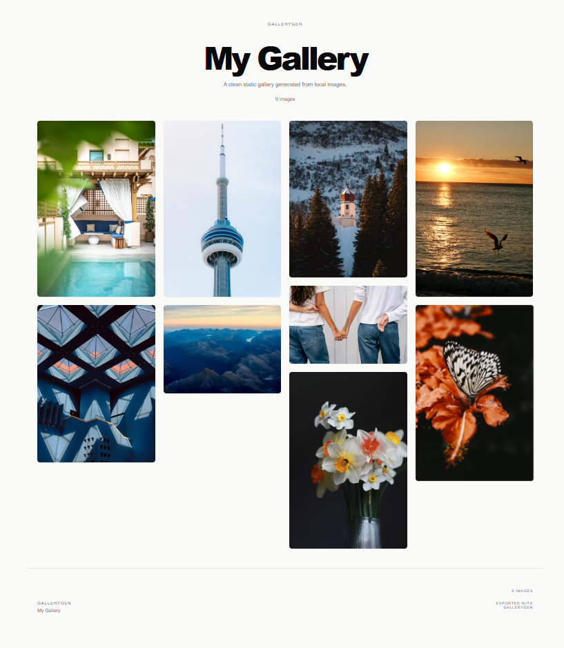
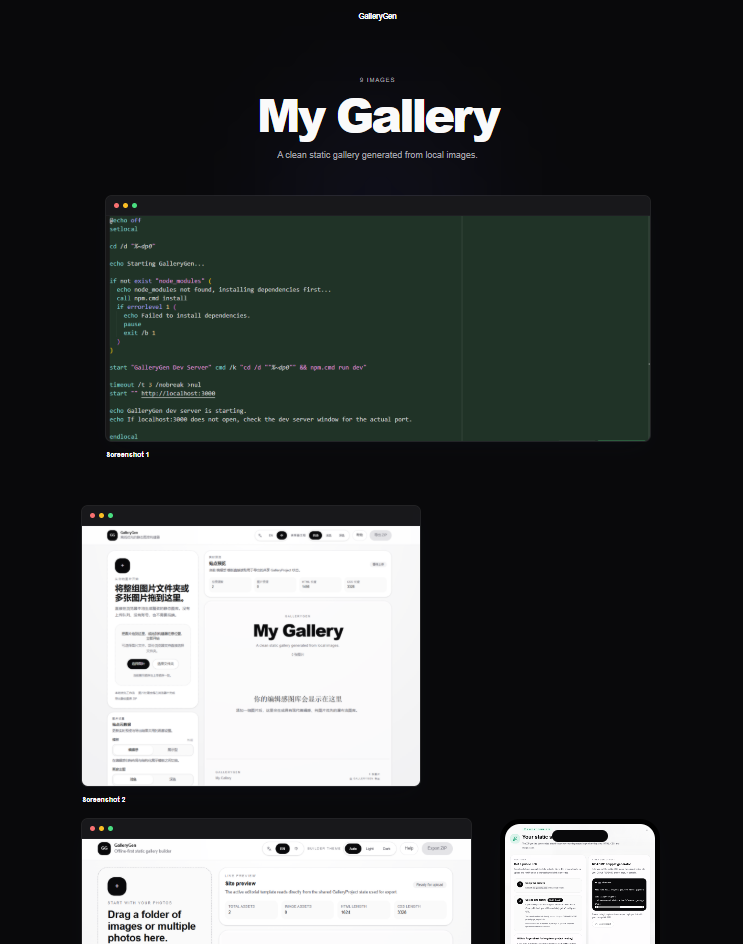
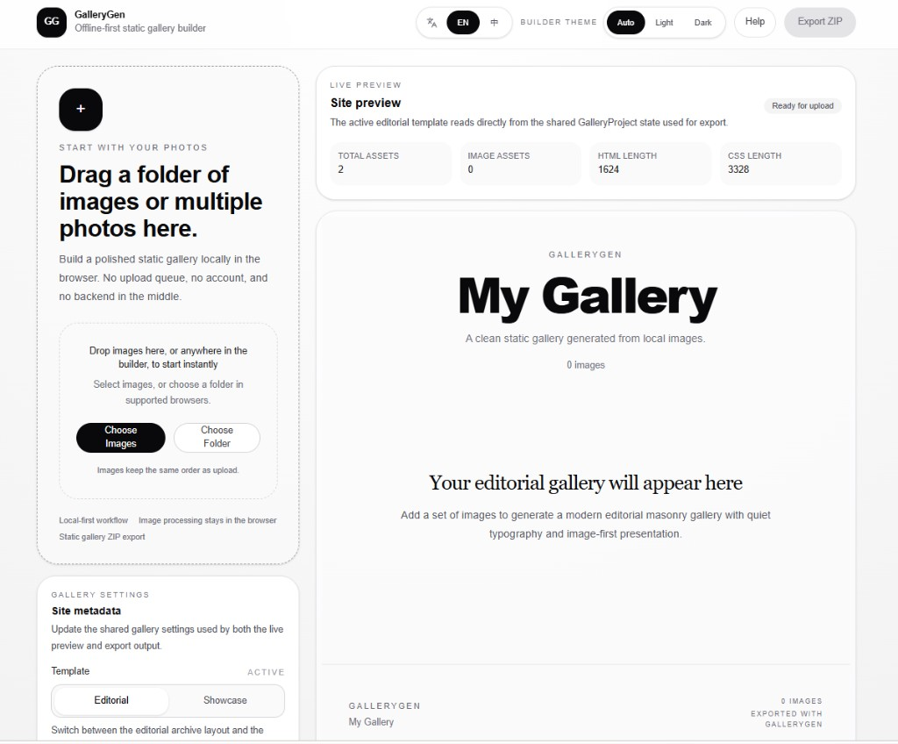

# GalleryGen

GalleryGen is a zero-config, offline-first visual showcase generator for turning local images and screenshots into polished static pages.

GalleryGen 是一个零配置、离线优先的视觉展示页生成器，可以把本地图片和截图整理成精致的静态展示页。

GalleryGen is built for open-source screenshots, SaaS and product visuals, design portfolios, and curated visual collections. It runs entirely in the browser: upload local files, preview the result live, switch between two templates, and export a ready-to-publish static site as a ZIP with no backend required.

GalleryGen 面向开源项目截图、SaaS 或产品视觉、设计作品集和各类视觉集合。整个流程都在浏览器中完成：导入本地文件、实时预览、切换两套模板，并导出可直接发布的静态站点 ZIP，不需要后端。

## Demo

- Demo video source: [`public/readme/demo.mp4`](public/readme/demo.mp4)
- GitHub may not preview a large MP4 inline. Use the screenshots below for a quick overview, or download the video locally.
- Template A live example: [https://gregarious-narwhal-e05197.netlify.app/](https://gregarious-narwhal-e05197.netlify.app/)
- Template B live example: [https://elaborate-starlight-03236e.netlify.app/](https://elaborate-starlight-03236e.netlify.app/)
- [Builder screenshot (EN)](public/readme/builder-en.png)
- [Builder screenshot (ZH)](public/readme/builder-zh.png)
- [Template A cover](public/readme/template-a-cover.png)
- [Template B cover](public/readme/template-b-cover.png)

## 演示

- 演示视频源文件：[`public/readme/demo.mp4`](public/readme/demo.mp4)
- GitHub 对较大的 MP4 内联预览并不稳定。可以先看下面的截图，或把视频下载到本地查看。
- Template A 在线示例：[https://gregarious-narwhal-e05197.netlify.app/](https://gregarious-narwhal-e05197.netlify.app/)
- Template B 在线示例：[https://elaborate-starlight-03236e.netlify.app/](https://elaborate-starlight-03236e.netlify.app/)
- [Builder 英文界面截图](public/readme/builder-en.png)
- [Builder 中文界面截图](public/readme/builder-zh.png)
- [Template A 封面图](public/readme/template-a-cover.png)
- [Template B 封面图](public/readme/template-b-cover.png)







## How to Use GalleryGen

1. Run the app locally with `npm install` and `npm run dev`.
2. Open the builder in your browser.
3. Upload screenshots or images from your computer.
4. Edit the title, description, template, and gallery theme.
5. Preview the result live, then export a static ZIP.
6. Publish the exported files with Netlify Drop or GitHub Pages.

## 如何使用 GalleryGen

1. 在本地运行项目：先执行 `npm install`，再执行 `npm run dev`。
2. 在浏览器中打开 Builder。
3. 上传你电脑里的截图或图片。
4. 编辑标题、描述、模板和画廊主题。
5. 实时预览效果，然后导出静态 ZIP。
6. 把导出的文件发布到 Netlify Drop 或 GitHub Pages。

## Why GalleryGen

- Local-first workflow: images stay in the browser during import, preview, and export.
- Built for showcase pages, not just image dumping.
- Two distinct templates for different presentation needs.
- Static ZIP export with HTML, CSS, and image assets.
- Useful for both README enhancement and full external showcase pages.
- No backend, account, or hosting lock-in.

## 为什么使用 GalleryGen

- 本地优先：图片导入、预览和导出都在浏览器内完成。
- 它做的不只是图片陈列，而是更完整的展示页生成。
- 提供两套风格明确的模板，适配不同展示场景。
- 可直接导出包含 HTML、CSS 和图片资源的静态 ZIP。
- 既适合增强 README，也适合生成独立的外部展示页。
- 不依赖后端、账号体系或特定托管平台。

## Templates

### Template A: Editorial / Gallery

Best for image-led collections, visual essays, and portfolio-style galleries. Template A emphasizes rhythm, spacing, and a quieter editorial presentation.

### 模板 A：Editorial / Gallery

适合图片主导的视觉集合、视觉叙事内容和偏作品集风格的展示页。Template A 更强调节奏、留白和偏编辑感的画面呈现。

### Template B: Screenshot / Showcase

Best for product screenshots, SaaS visuals, open-source demo pages, design boards, and UI mockups. Template B is the stronger option when the goal is to present a product or project clearly and cleanly.

### 模板 B：Screenshot / Showcase

适合产品截图、SaaS 视觉、开源项目展示页、设计看板和 UI 样机。Template B 更适合把一个产品或项目清晰、克制地展示出来。

## How It Works

1. Upload local images with drag and drop or the file picker.
2. Preview the gallery live in the browser.
3. Switch between Template A and Template B in the builder.
4. Export a ZIP containing the static site and image assets.
5. Publish the exported files as a static site and share the public link.

## 工作流程

1. 通过拖拽或文件选择器导入本地图片。
2. 在浏览器中实时预览展示页效果。
3. 在构建器里切换 Template A 和 Template B。
4. 导出包含静态页面和图片资源的 ZIP。
5. 将导出结果发布为静态站点并分享公开链接。

## Best Use Cases

- Open-source project screenshots
- SaaS and app visuals
- Design portfolios
- Visual collections

## 适用场景

- 开源项目截图展示
- SaaS 与应用产品视觉
- 设计作品集
- 各类视觉集合

## Publishing the Result

- Netlify Drop is the fastest path to a public link: unzip the export, drag the folder in, and get a shareable URL.
- GitHub Pages is a GitHub-native long-term option if you want the showcase to live alongside a repository or project site.
- The export success flow also includes lightweight publishing guidance and a README snippet generator.

## 发布导出结果

- 如果想最快获得公开链接，Netlify Drop 是最直接的路径：解压导出结果、拖入文件夹、立即拿到可分享地址。
- 如果希望展示页长期挂在 GitHub 项目旁边，GitHub Pages 是更自然的长期托管方式。
- 导出成功后的流程里也已经包含了轻量发布指引和 README 片段生成器。

## Tech Stack

- Next.js App Router
- React
- TypeScript
- Tailwind CSS
- Zustand
- JSZip

## 技术栈

- Next.js App Router
- React
- TypeScript
- Tailwind CSS
- Zustand
- JSZip

## Local Development

Install dependencies:

```bash
npm install
```

Start the development server:

```bash
npm run dev
```

Open [http://localhost:3000](http://localhost:3000) in your browser.

Validate the project:

```bash
npm run lint
npx tsc --noEmit
npm run build
```

## 本地开发

安装依赖：

```bash
npm install
```

启动开发服务器：

```bash
npm run dev
```

然后在浏览器中打开 [http://localhost:3000](http://localhost:3000)。

发布前校验：

```bash
npm run lint
npx tsc --noEmit
npm run build
```

## Exported Output

The current export bundle includes:

- `index.html`
- `styles.css`
- `images/...` for uploaded assets

The output is plain static HTML, CSS, and images, suitable for standard static hosting.

## 导出内容

当前导出的 ZIP 包含：

- `index.html`
- `styles.css`
- `images/...` 图片资源目录

导出结果是标准静态 HTML、CSS 和图片文件，可以直接部署到常见静态托管平台。

## Project Status

GalleryGen is currently MVP v1.

The current release covers the full local-to-static workflow:

- local image upload
- live preview
- template switching
- ZIP export
- post-export publishing guidance
- README snippet generation

The scope is intentionally narrow for this release.

## 项目状态

GalleryGen 当前处于 MVP v1 阶段。

这一版已经覆盖完整的本地到静态站点流程：

- 本地图片导入
- 实时预览
- 模板切换
- ZIP 导出
- 导出后的发布指引
- README 片段生成

当前版本的范围是有意保持克制的。

## Roadmap

- Improve drag-and-drop and ordering ergonomics
- Refine export polish and publishing guidance
- Add better example assets and public demos
- Expand metadata editing carefully without turning the builder into a CMS
- Introduce more templates only when they are meaningfully distinct

## 路线图

- 继续优化拖拽导入和排序体验
- 打磨导出细节与发布指引
- 补充更完整的示例素材和公开演示
- 谨慎扩展元数据编辑能力，但不把 Builder 做成 CMS
- 只在模板之间确实有明显差异时再继续增加新模板

## Contributing

Contributions, issue reports, and focused product feedback are welcome.

If you want to contribute:

1. Open an issue or discussion first for larger changes.
2. Keep pull requests focused and incremental.
3. Make sure lint, typecheck, and build all pass before submitting.

## 参与贡献

欢迎提交 issue、产品反馈和聚焦明确的贡献。

如果你想参与贡献：

1. 较大的改动建议先开 issue 或 discussion 讨论。
2. 请尽量保持 PR 范围清晰、改动克制。
3. 提交前请确保 lint、typecheck 和 build 都能通过。

## License

GalleryGen is licensed under the MIT License. See [`LICENSE`](LICENSE) for details.

## 许可证

GalleryGen 采用 MIT License，详见根目录下的 [`LICENSE`](LICENSE)。
